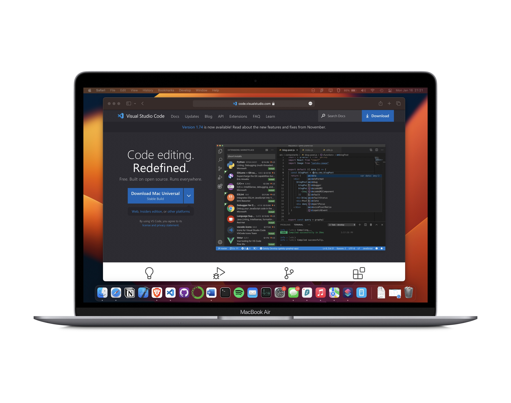
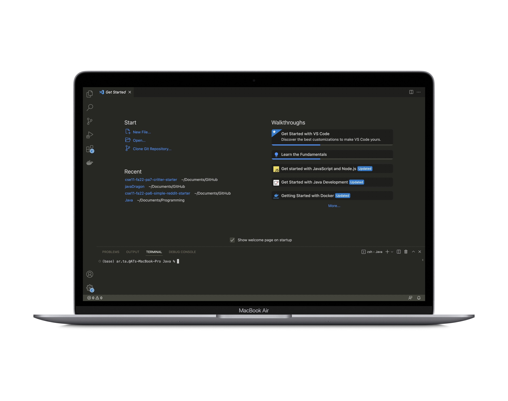

Hello! My name is Arnav Talreja and in this tutorial, I'll guide you through the process of logging into your course-specific account on the ieng6 server.
Let's get started!

**# Installing VS Code**
We'll start of by downloading and installing a source code editor. There are a lot of source code editors out there but for this tutorial, we'll be using VS Code.
You can downlaod VS code from the following link:-
[https://code.visualstudio.com](https://code.visualstudio.com)
**NOTE:** *Make sure to download the version of VS Code suitable for your operating system.*

The dowloaded file will probably go to the Downloads folder on you machine. Find and run the downloaded file and follow on screen instructions to finish intalling VS Code. 
Once the installation process is complete, open VS Code. You will be greeted by a page that might look something like the following:-

